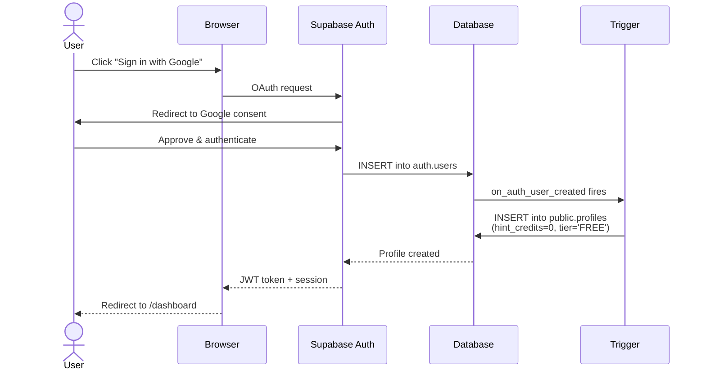
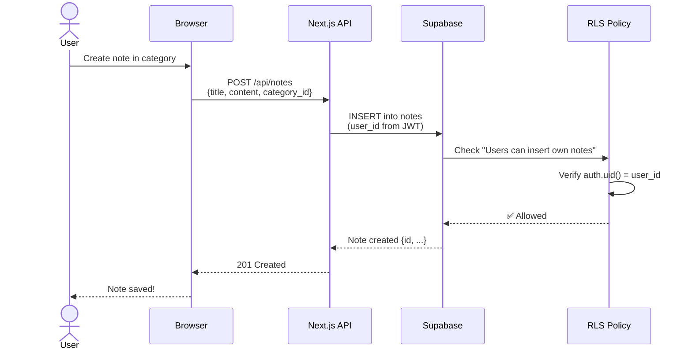
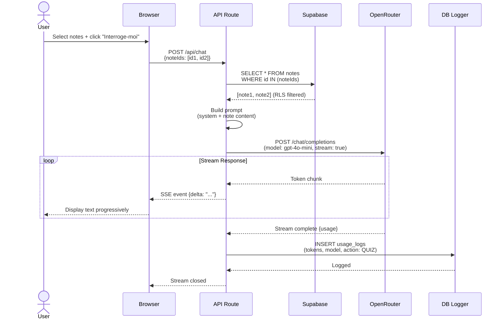
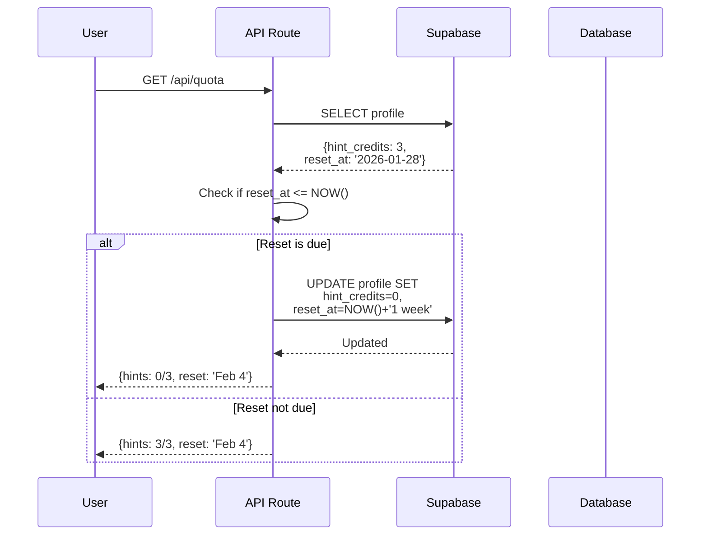
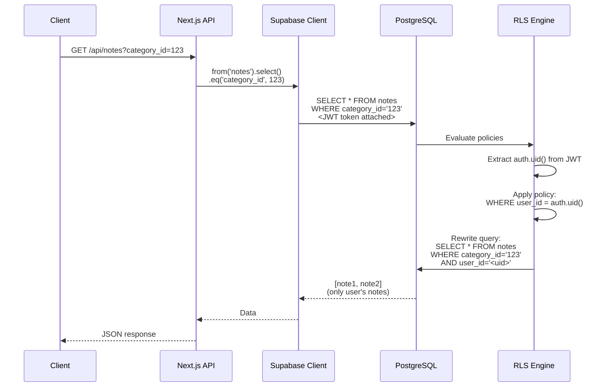
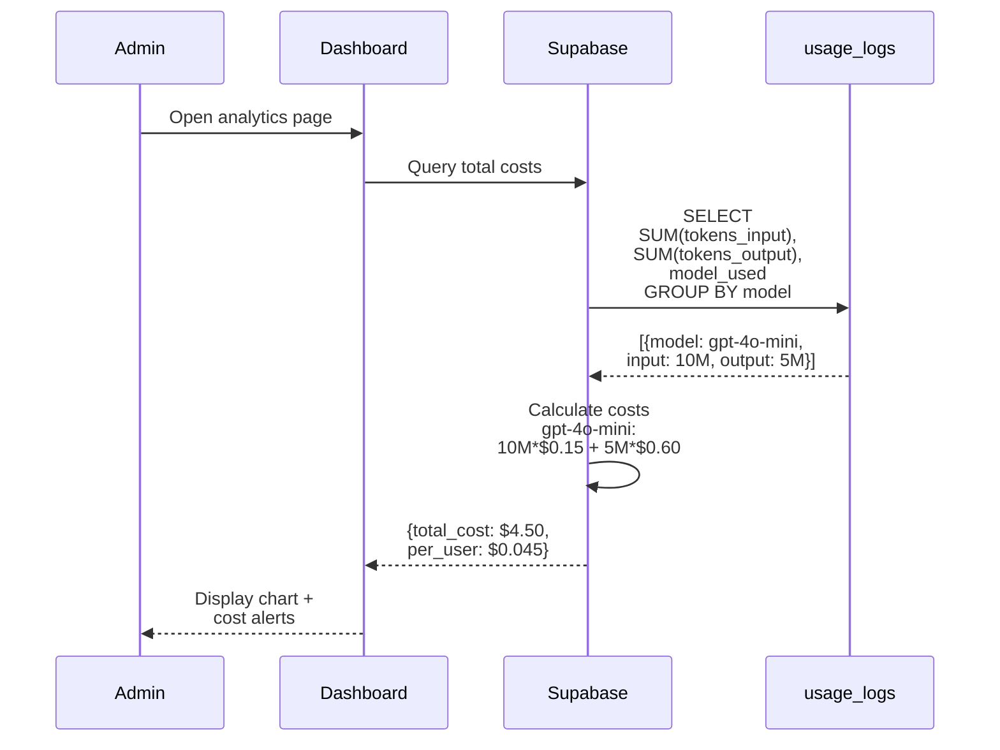
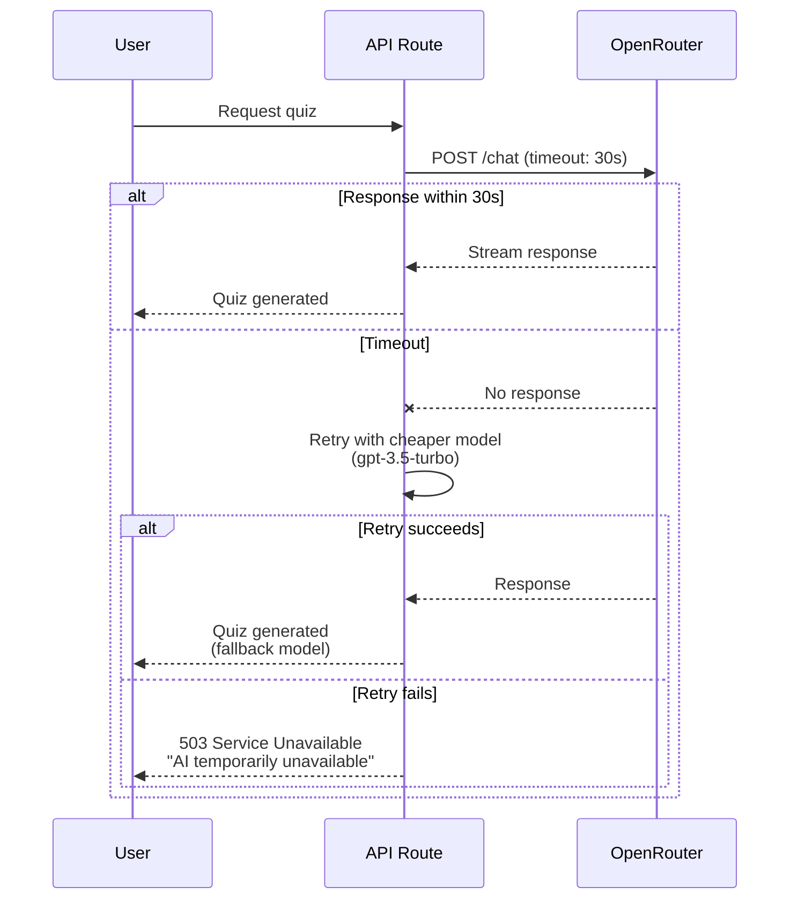
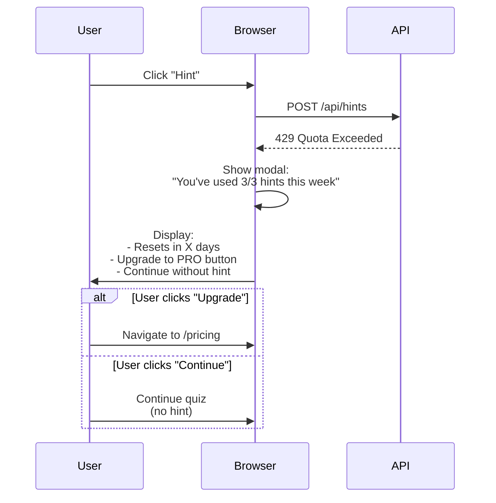

# Echoflow - API Sequence Diagrams

**Author:** Winston (Architect)  
**Date:** 2026-02-01  
**Purpose:** Visual documentation of system flows for developers

---

## 1️⃣ User Signup Flow



**Key Points:**
- Profile creation is automatic (via trigger)
- User starts with FREE tier, 0/3 hints used
- Reset date set to 7 days from signup

---

## 2️⃣ Create Note Flow



**Key Points:**
- `user_id` extracted from JWT (not client input)
- RLS policy prevents users from creating notes for others
- Automatic `created_at` and `updated_at` timestamps

---

## 3️⃣ Quiz Generation Flow (Core Feature)



**Key Points:**
- RLS automatically filters notes to user's only
- Streaming provides real-time UX
- Usage logged for cost tracking
- No quota deduction (core feature is unlimited)

---

## 4️⃣ Hint Request Flow (Quota-Limited Feature)

```mermaid
sequenceDiagram
    actor User
    participant Browser
    participant API Route
    participant Supabase
    participant use_hint_credit()
    participant OpenRouter

    User->>Browser: Click "Demander un indice"
    Browser->>API Route: POST /api/hints<br/>{context}
    
    API Route->>Supabase: rpc('use_hint_credit', {user_uuid})
    
    Supabase->>use_hint_credit(): BEGIN TRANSACTION
    use_hint_credit()->>use_hint_credit(): SELECT ... FOR UPDATE<br/>(lock row)
    use_hint_credit()->>use_hint_credit(): Check tier='FREE'<br/>AND credits < 3
    
    alt Quota exceeded
        use_hint_credit()-->>Supabase: RAISE EXCEPTION
        Supabase-->>API Route: Error: quota exceeded
        API Route-->>Browser: 429 Too Many Requests
        Browser-->>User: "Limite atteinte.<br/>Recharge le [date]"
    else Quota OK
        use_hint_credit()->>use_hint_credit(): UPDATE hint_credits + 1
        use_hint_credit()-->>Supabase: COMMIT (new credits: 1)
        Supabase-->>API Route: Success {hint_credits: 1}
        
        API Route->>OpenRouter: Generate hint (streaming)
        OpenRouter-->>API Route: Hint text
        
        API Route->>Supabase: INSERT usage_logs<br/>(action: HINT)
        
        API Route-->>Browser: 200 OK {hint, remaining: 2}
        Browser-->>User: Display hint
    end
```

**Key Points:**
- **Atomic operation** prevents race conditions
- `FOR UPDATE` locks row during transaction
- PRO tier users bypass quota check
- Remaining hints displayed to user

---

## 5️⃣ Weekly Hint Reset Flow

```mermaid
sequenceDiagram
    participant Cron Job
    participant Supabase
    participant Database
    participant reset_hint_credits()

    Cron Job->>Supabase: Daily trigger (00:00 UTC)
    Supabase->>reset_hint_credits(): CALL function
    
    reset_hint_credits()->>Database: SELECT users<br/>WHERE reset_at <= NOW()
    Database-->>reset_hint_credits(): [user1, user2, ...]
    
    loop For each user
        reset_hint_credits()->>Database: UPDATE profiles SET<br/>hint_credits=0,<br/>reset_at=NOW()+'1 week'
    end
    
    reset_hint_credits()-->>Supabase: Rows updated: N
    Supabase-->>Cron Job: Success
    
    Note over Cron Job: Send email to users<br/>"Your hints refreshed!"
```

**Alternative: Application-Level Fallback**



**Key Points:**
- Cron is primary method (runs daily)
- Application checks on every quota request (fallback)
- **Defense in depth** ensures hints always reset

---

## 6️⃣ RLS Policy Enforcement Flow



**Key Points:**
- RLS is automatic (developer can't forget it)
- JWT token carries user identity
- Query is rewritten before execution
- **Even service role can't bypass RLS** (unless explicitly using service key)

---

## 7️⃣ Cost Tracking & Analytics Flow



**Monitoring Queries:**

```sql
-- This week's costs
SELECT 
  model_used,
  COUNT(*) as calls,
  SUM(tokens_input) as input_tokens,
  SUM(tokens_output) as output_tokens,
  -- Cost estimation (gpt-4o-mini pricing)
  (SUM(tokens_input) * 0.15 / 1000000.0 + 
   SUM(tokens_output) * 0.60 / 1000000.0) as estimated_cost
FROM usage_logs
WHERE created_at > NOW() - INTERVAL '7 days'
GROUP BY model_used;

-- Top 10 users by usage
SELECT 
  user_id,
  COUNT(*) as total_calls,
  SUM(tokens_input + tokens_output) as total_tokens
FROM usage_logs
WHERE created_at > NOW() - INTERVAL '30 days'
GROUP BY user_id
ORDER BY total_tokens DESC
LIMIT 10;
```

---

## 8️⃣ Error Handling Flows

### OpenRouter API Timeout



### Quota Exceeded (Soft Landing)



---

## 🎓 Developer Notes

### When to Use Each Flow

1. **Quiz Generation** - Most common (90% of API calls)
2. **Hint Request** - Occasional (10% of API calls)
3. **Note CRUD** - Frequent but simple (client-side RLS handles security)
4. **Quota Check** - On every hint + displayed in UI header
5. **Reset** - Automated daily cron

### Performance Considerations

- **Streaming**: Essential for UX (don't buffer entire response)
- **RLS overhead**: ~10ms per query (acceptable)
- **Atomic functions**: Add locking overhead but prevent bugs
- **Indexing**: Composite indexes speed up common queries 20-30%

### Security Checklist

- ✅ Never trust client input for `user_id` (always use JWT)
- ✅ Always enable RLS on new tables
- ✅ Use `FOR UPDATE` in atomic operations
- ✅ Validate API inputs with Zod schemas
- ✅ Rate limit API endpoints (Vercel Edge Config)

---

**Next:** See `Backend/developer-guide.md` for implementation examples  
**Updated:** 2026-02-01 by Winston (Architect)
